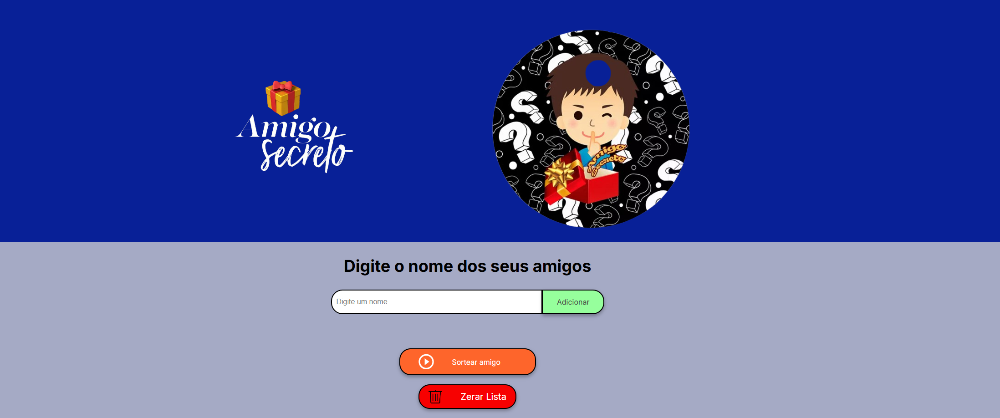

# 🎁 Sorteio de Amigo Secreto

Este é um projeto desenvolvido como parte do desafio do **BootCamp Oracle Next Education (ONE)**. Ele permite gerenciar uma lista de participantes e realizar sorteios de amigo secreto de forma prática e divertida.

## 📝 Funcionalidades

- Adicionar participantes à lista.
- Visualizar a lista atualizada em tempo real.
- Sortear um amigo secreto aleatoriamente.
- Remover participantes da lista após o sorteio.
- Limpar a lista inteira com uma mensagem de confirmação.
- Mensagens de erro para entradas inválidas ou tentativas de sorteio sem participantes.

## 🚀 Tecnologias e Ferramentas Utilizadas

- **HTML**: Estrutura do conteúdo.
- **CSS**: Estilização da aplicação.
- **JavaScript**: Funcionalidades dinâmicas e lógica do sorteio.
- **Virtual Studio Code**: Editor de código.

## 📋 Como Usar

1. Clone este repositório em sua máquina local:
   ```bash
   git clone https://github.com/fabioamoreira/amigo-sercreto.github.io.git
2. Acesse o link:
   https://fabioamoreira.github.io/amigo-sercreto.github.io/
   
## 🖼️ Demonstração

[](https://www.youtube.com/watch?v=bRJ_M6ss2L0)
